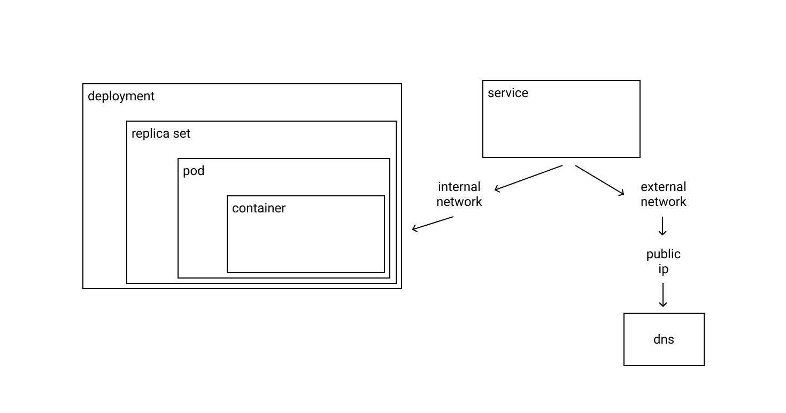

# kubernetes

### schema

### concepts

- pod: make the management of containers
- replica set / deployment: have similar functions (make the management of image version and rules)

obs: replica set is responsible to build another pod when any pod is down

- service: expose the deployment on externally

### tools to execute on localhost

- kind
- minikube

### graphical tools

- dashboard (only on minikube / local)
- [lens](https://k8slens.dev/)

### interfaces

- kubeadm: automate cluster build proccess
- kubelet: make the exchange of messages (interface betweeen docker and k8s)
- kubectl: CLI of interaction
- control plane: (only on master node)
  - etcd: distribuited storage with key / value
  - kube-apiserver: api of k8s (rest standard)
  - kube-controller-manager: perform the monitoring and others proccess
  - kube-scheduler: work as a load balancer
  - kube-proxy: add firewall rules and work with nodes communication

### network plugins

- flannel
- weave

### supported formats for config map

- yaml (preferential)
- json

### types

- Pod
- Node
- Deployment
- ReplicaSet
- Service
